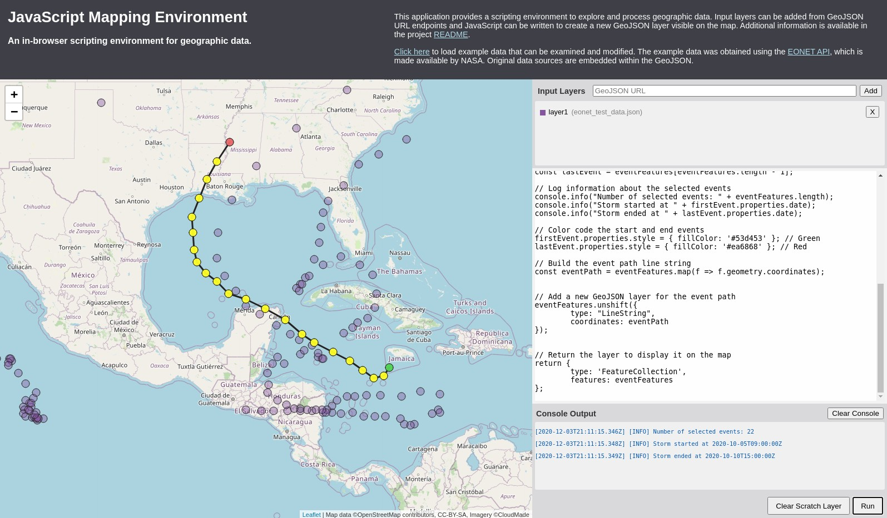

# JavaScript Mapping Environment

This project has been developed for the University of Leeds GEOG5012M course. The application is [hosted on GitHub Pages](https://anth-dj.github.io/geog5012m_project/) and the source code is [hosted on GitHub](https://github.com/anth-dj/geog5012m_project), including this [README](https://github.com/anth-dj/geog5012m_project/blob/main/README.md).

## Overview

The JavaScript Mapping Environment project leverages open source libraries and the web browser's JavaScript interpreter to create a basic scripting environment for geographic data. The page is divided in half, with an interactive map view on one side and scripting components on the other.

The primary purpose of this application is to allow quick iteration in the processing and exploration of geographic data, while providing immediate visual feedback on the map.

The application consists of four main components:
* **Map** - displays geographic information on an interactive map
* **Input Layers** - allows loading of GeoJSON data from a URL link and lists the input layers currently visible on the map 
* **Script** - a text area to write JavaScript code that analyzes or transforms the input layer data
* **Console Output** - displays the browser JavaScript console output

## Usage Instructions

To add an input layer, enter a URL to a GeoJSON source in the text field and click Add. This will add a GeoJSON layer to the map view with an assigned colour and identifier. The identifier can then be referenced as a global variable in the embedded JavaScript text area. 

Any valid JavaScript code can be entered in the text area and executed by clicking Run. Each layer identifier is available as a global variable and a special `inputLayers` variable references a list of all added input layers. If a GeoJSON object is returned at the end of the script it will be displayed on the map as a temporary `scratch` layer, which will itself be available as a global variable in the next script run.

## Future Work

Because this project has been developed to satisfy the GEOG5012M final project requirements in a limited amount of time, some useful features are incomplete or missing. Additional work may include:

* incorporation of a code editing component with syntax highlighting
* filesystem data import/export
* integration of open source spatial analysis JavaScript libraries

## References

This application was developed using reference material from the following sources:

* University of Leeds GEOG5012M course material
* Mozilla and individual contributors. 2020. MDN Web Docs. [Online]. [Accessed 30 November 2020]. Available from: https://developer.mozilla.org/

Map data is provided by:
* OpenStreetMap contributors. 2020. OpenStreetMap tiles. OpenStreetMap Foundation. [Online]. [Accessed 30 November 2020]. Available from: https://www.openstreetmap.org/
* Earth Science Data Systems Program and NASA Earth Observatory. 2020. Earth Observatory Natural Events Tracker (3.0). [Software]. [Accessed 30 November 2020].

Source code dependencies include:
* Agafonkin, V. 2020. Leaflet (1.7.1). [Software]. [Accessed 30 November 2020]
* The jQuery Foundation. 2020. jQuery (1.7.2). [Software]. [Accessed 30 November 2020].

## License

This project is made publicly available under the MIT license (see the [LICENSE](./LICENSE) file).